# VOICEVOX For Premier Pro



## Whit this can do

- Premiere Pro上のテキストからVOICEVOX ENGINE経由で音声合成を行い、音声を出力したものをPremiere Pro上に挿入することができる。

## Development

### OpenAPI

音声合成エンジンが起動している状態で以下のコマンドを実行。

```bash
# <Windows>
curl http://127.0.0.1:50021/openapi.json -o openapi.json

openapi-generator-cli generate -i openapi.json -g typescript-fetch -o src/js/openapi/ --additional-properties "modelPropertyNaming=camelCase,supportsES6=true,withInterfaces=true,typescriptThreePlus=true"

# <Linux/MacOS>
curl http://127.0.0.1:50021/openapi.json >openapi.json

npx openapi-generator-cli generate \
    -i openapi.json \
    -g typescript-fetch \
    -o src/js/openapi/ \
    --additional-properties "modelPropertyNaming=camelCase,supportsES6=true,withInterfaces=true,typescriptThreePlus=true"
```
